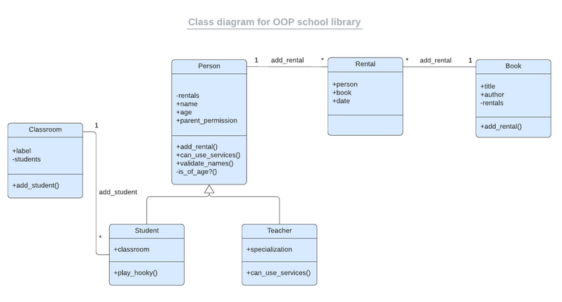

# University ibrary app

> Imagine that you are the librarian of OOP University, and you need a tool to record what books are in the library and who borrows them. 

This will be a console app.

## Built With

- Ruby
- UML
- OOP

## Getting Started

Use bundle-install to get all the dependencies.

## Authors

👨‍💻 **Herbert Orellana**
​
- GitHub: [@herokudev](https://github.com/herokudev)
- LinkedIn: [LinkedIn](https://www.linkedin.com/in/herbert-orellana/)

## 🤝 Contributing

Contributions, issues, and feature requests are welcome!

Feel free to check the [issues page](../../issues/).

## Show your support

Give a ⭐️ if you like this project!

## Acknowledgments

- Hat tip to anyone whose code was used
- Inspiration
- etc

## 📝 License

This project is [MIT](./MIT.md) licensed.
